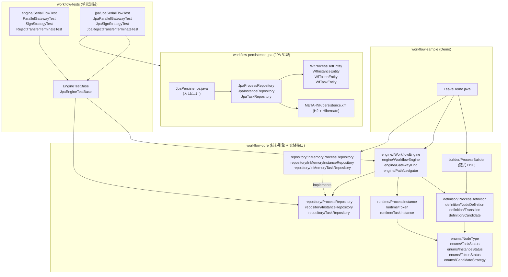
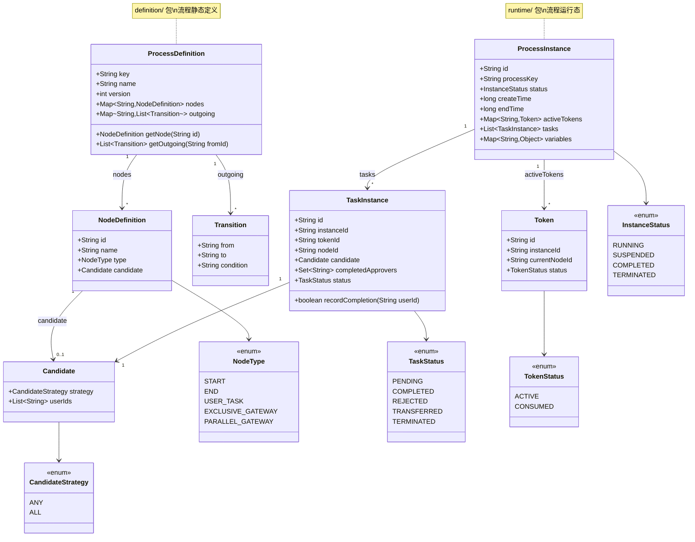
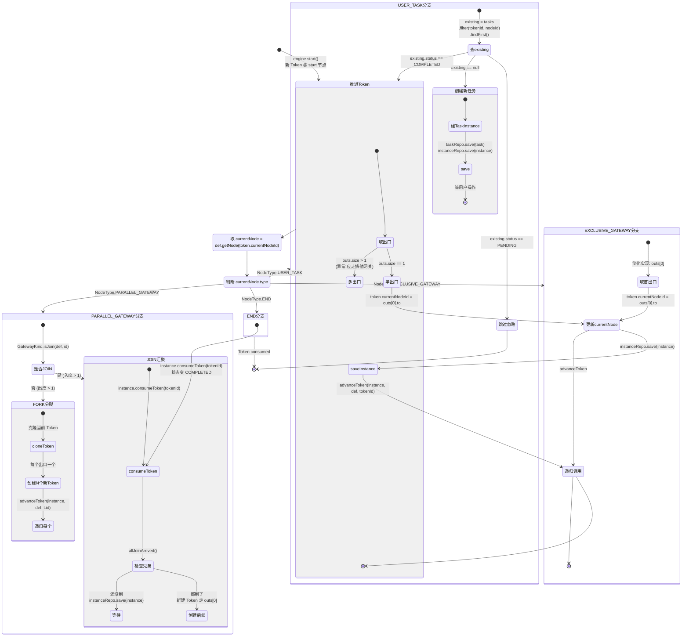
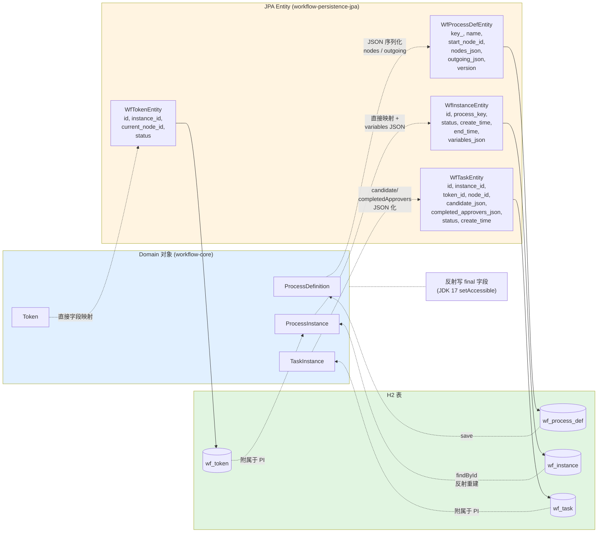
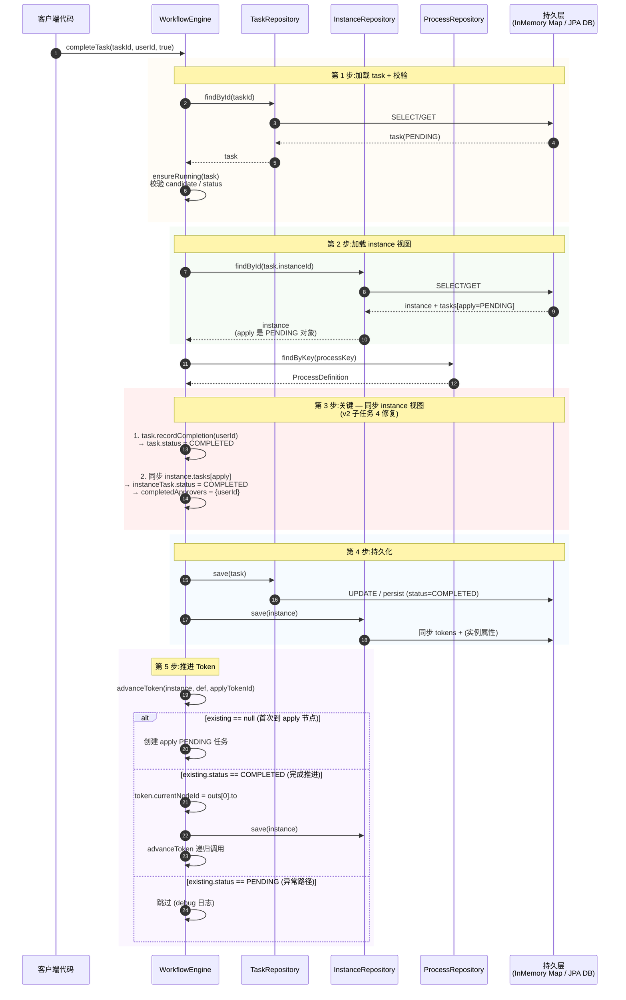

# 自研工作流引擎 — 架构图

> 6 张图覆盖完整链路：模块依赖 / DSL 流程 / Domain 模型 / 引擎调度 / JPA 持久化 / 请求时序。
> 全部使用 Mermaid 语法（GitHub / VS Code / Typora / Obsidian 原生支持）。

---

## 图 1：模块依赖

展示 4 个 Gradle 模块的依赖关系 + 各模块的内部包结构。



**关键点**：
- `workflow-core` 是叶子节点（不依赖任何其他模块）
- `workflow-sample` 与 `workflow-tests` 都通过 `repository/` 接口注入实现（依赖倒置）
- `workflow-persistence-jpa` 实现 core 的仓储接口,通过 `api(project(":workflow-core"))` 暴露

---

## 图 2：DSL 流程示例

请假审批 Demo 的 DSL 定义 + 运行时 Token 流转。

```mermaid
flowchart LR
    start([start]) --> apply[apply<br/>userTask<br/>ANY employee]
    apply --> manager[manager<br/>userTask<br/>ANY managerA, managerB]
    manager --> hr[hr<br/>userTask<br/>ANY hr]
    hr --> end([end])

    %% Token 流转示意
    T0[/"Token#0<br/>@start"/] -.->|advanceToken| T1[/"Token#1<br/>@apply"/]
    T1 -.->|completeTask<br/>employee| T2[/"Token#2<br/>@manager"/]
    T2 -.->|completeTask<br/>managerA| T3[/"Token#3<br/>@hr"/]
    T3 -.->|completeTask<br/>hr| T4[/"Token#4<br/>@end<br/>consumed"/]

    style T0 fill:#e1f5e1
    style T1 fill:#fff4e1
    style T2 fill:#fff4e1
    style T3 fill:#fff4e1
    style T4 fill:#f5e1e1
```

**并行网关版本（fork/join）**：

```mermaid
flowchart LR
    start([start]) --> apply[apply]
    apply --> fork{{"fork<br/>PARALLEL_GATEWAY"}}
    fork --> branchA[branchA<br/>userTask]
    fork --> branchB[branchB<br/>userTask]
    branchA --> join{{"join<br/>PARALLEL_GATEWAY"}}
    branchB --> join
    join --> end([end])

    T0[/"Token#0"/] -.->|fork| TA[/"Token#A<br/>@branchA"/]
    T0 -.->|fork| TB[/"Token#B<br/>@branchB"/]
    TA -.->|branchA 完成| TCA[/"Token#A<br/>consumed"/]
    TB -.->|branchB 完成| TCB[/"Token#B<br/>consumed"/]
    TCA -.->|join 汇聚| TNext[/"Token#Next<br/>@end"/]
    TCB -.->|join 汇聚| TNext

    style fork fill:#ffe1e1
    style join fill:#ffe1e1
```

---

## 图 3：Domain 模型（类图）



**关键点**：
- `definition/` 是**静态结构**（不可变,编译期固定）
- `runtime/` 是**动态状态**（随任务流转变化）
- `TaskInstance.candidate` 与 `NodeDefinition.candidate` 是**同一对象引用**——避免冗余

---

## 图 4：引擎调度核心（`advanceToken` 状态机）



**关键路径**：
1. **start()** → 创建 Token @ START 节点 → advanceToken
2. **USER_TASK existing==null** → 创建 PENDING 任务 → 等用户操作
3. **completeTask** → task.recordCompletion + save + **同步 instance 视图** + advanceToken
4. **USER_TASK existing.COMPLETED** → 更新 token.currentNodeId → 递归 advanceToken

---

## 图 5：JPA 持久化（Domain ↔ Entity ↔ Table）



**映射策略**：

| Domain | Entity | 映射方式 |
|---|---|---|
| `ProcessDefinition.nodes` | `WfProcessDefEntity.nodes_json` | `JSON.toJSONString` 序列化到 TEXT |
| `ProcessInstance.variables` | `WfInstanceEntity.variables_json` | fastjson2 序列化 |
| `TaskInstance.candidate` | `WfTaskEntity.candidate_json` | fastjson2 序列化 |
| `TaskInstance.completedApprovers` | `WfTaskEntity.completed_approvers_json` | fastjson2 序列化 |
| `TaskInstance.status` | `WfTaskEntity.status` | `@Enumerated(STRING)` 直接映射 |

**关键点**：
- Domain 对象**不可变 + 无 setter**——JPA 仓储用反射写 final 字段
- Token **不单独 save**——`instanceRepo.save` 内部全量同步（DELETE ALL + persist）
- Task **单独 save**（频繁 update 状态）——`taskRepo.save` upsert

---

## 图 6：一次 `completeTask` 的时序

展示 InMemory 与 JPA 的差异点（重点是 **JPA 下 instance 视图同步**）。



**InMemory vs JPA 关键差异**：

| 步骤 | InMemory | JPA |
|---|---|---|
| `taskRepo.findById` | 返回内存 Map 引用 | 返回 WfTaskEntity → 反射重建的 TaskInstance |
| `instanceRepo.findById` | 返回内存引用（同一 task 对象） | 返回 WfInstanceEntity + 重建的 TaskInstance（**新对象**） |
| `task.recordCompletion` | 修改内存对象 → instance.tasks[0] **自动跟随** | 修改 line 91 task → instance.tasks[0] **不跟随**（不同引用） |
| **必须同步 instance 视图** | 否 | **是**（v2 子任务 4 修复） |

---

## 📎 附录：图与代码的映射表

| 图 | 主要对应源码 |
|---|---|
| 图 1 模块依赖 | `settings.gradle.kts`, `build.gradle.kts` |
| 图 2 DSL 流程 | `builder/ProcessBuilder.java`, `sample/LeaveDemo.java` |
| 图 3 Domain 模型 | `definition/*`, `runtime/*`, `enums/*` |
| 图 4 引擎调度 | `engine/WorkflowEngine.java#advanceToken`, `engine/GatewayKind.java`, `engine/PathNavigator.java` |
| 图 5 JPA 映射 | `persistence-jpa/entity/*`, `persistence-jpa/repository/*` |
| 图 6 时序 | `engine/WorkflowEngine.java#completeAndAdvance` |

---

## 🔧 在各平台查看

| 平台 | 查看方式 |
|---|---|
| **GitHub** | 直接渲染 Mermaid,无需插件 |
| **VS Code** | 安装 `Markdown Preview Mermaid Support` 扩展 |
| **Typora** | 原生支持,无需设置 |
| **Obsidian** | 原生支持 |
| **IntelliJ IDEA** | 安装 `Markdown Navigator` 插件 |
| **在线预览** | [mermaid.live](https://mermaid.live/) 粘贴代码预览 |

---

_本文档随代码演进同步更新。_
